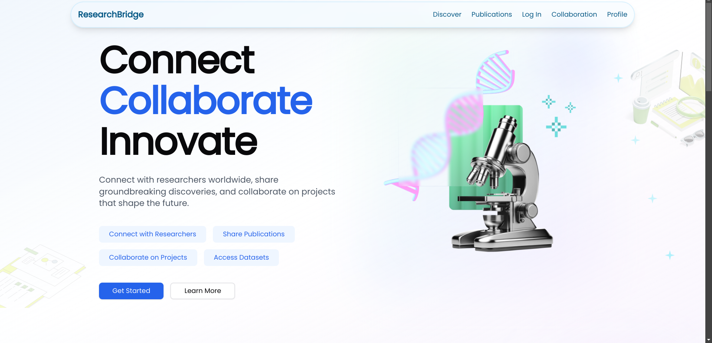
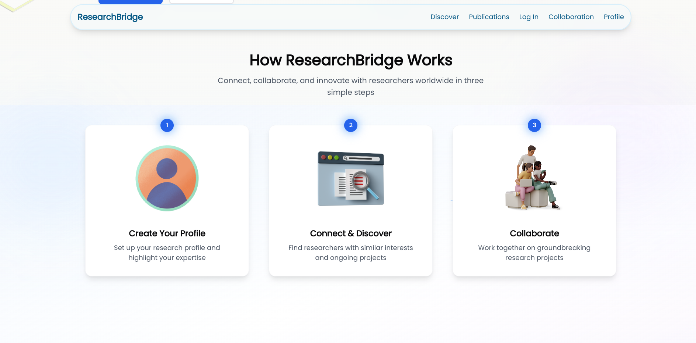
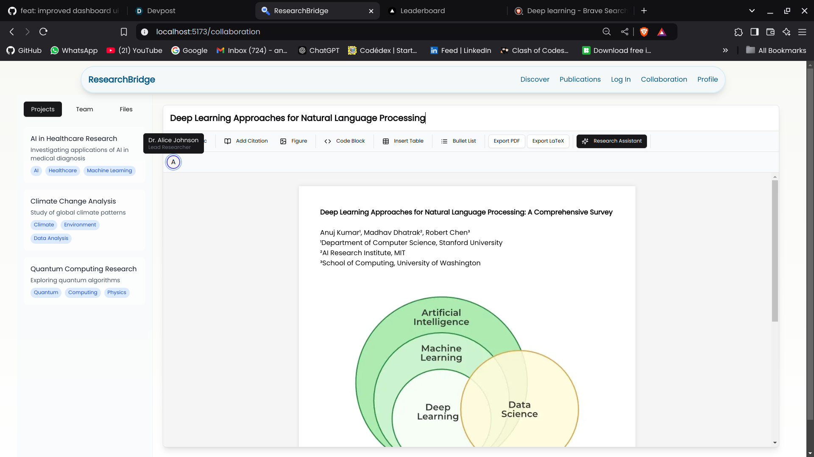
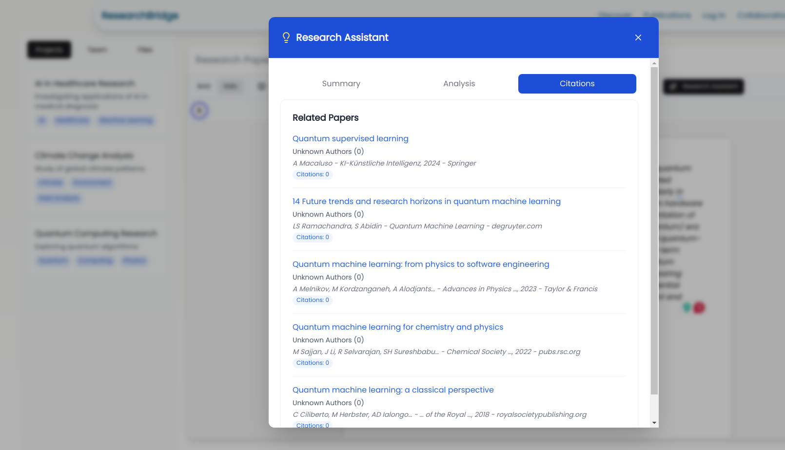
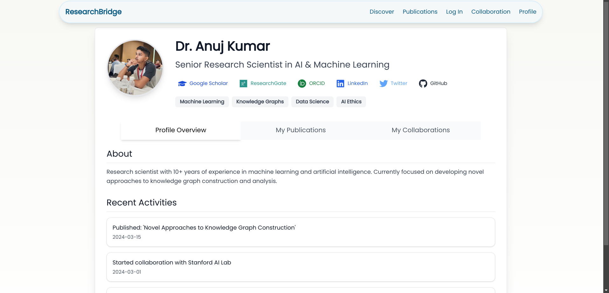

# ResearchBridge

ResearchBridge is an innovative research platform developed for the Hypermode Knowledge Graph + AI Challenge. It empowers researchers with real-time collaboration tools, advanced citation management, and AI-powered research assistance.

## Project Goals

- Streamline academic research workflow through AI-assisted paper analysis
- Enable real-time collaboration between researchers
- Provide intelligent citation network visualization and management
- Offer contextual research suggestions and gap analysis
- Create a knowledge graph of research papers and their relationships


## Screenshots


*Main dashboard showing the project interface*


*Workflow diagram explaining the system architecture*


*Real-time collaborative text editor interface*


*AI-powered research assistant integrated with Modus*


*User profile and research management page*

## Implementation

### Architecture

The project is built using a modern tech stack:

- **Frontend**: React with TypeScript
- **Backend**: Go with WebSocket support
- **AI Integration**: Google's Gemini Pro API via Modus Framework
- **Knowledge Graph**: Neo4j for citation network analysis
- **Real-time Collaboration**: WebSocket-based communication

### AI Models & Integration

1. **Gemini Pro Integration**
   - Implemented through Modus Framework for research analysis
   - Provides paper summaries, methodology analysis, and research gaps identification
   - Generates contextual research suggestions and related topics
   - Analyzes research impact and limitations

2. **Citation Analysis**
   - Uses Google Scholar API integration for citation data
   - Tracks citation metrics and impact factors
   - Generates citation networks and relationship graphs

### Knowledge Graph Implementation

The project utilizes Neo4j as the primary knowledge graph database to:
- Store and analyze paper relationships
- Track citation networks and academic influence
- Identify research clusters and emerging topics
- Enable graph-based paper recommendations

### Modus Framework Integration

The Modus Framework is used to:
- Manage AI service connections
- Handle authentication and API key management
- Provide structured endpoints for AI interactions
- Enable seamless integration with Gemini Pro API

## Key Features

- Real-time collaborative text editor with multi-user support
- Advanced citation network visualization
- AI-powered research assistant integration
- WebSocket-based real-time communication
- Modern, intuitive user interface with exceptional UX design
- Seamless document management and version control


## Technical Requirements

Before running the project, ensure you have:
- Node.js (v14 or higher)
- Go (v1.16 or higher)
- npm or yarn package manager
- Neo4j Database
- Google Cloud API credentials for Gemini Pro
- SERP API key for Google Scholar integration

## Setup Instructions

### Frontend Setup
```bash
cd frontend
npm install
```

### Backend Setup
```bash
cd backend
npm install
```

### Citation Network Setup
```bash
cd citation-network
go mod tidy
```

### Environment Configuration
Create a `.env` file in the citation-network directory with:
```
MODUS_GEMINI_API_KEY=your_gemini_api_key
SERP_API_KEY=your_serp_api_key
NEO4J_URI=your_neo4j_uri
NEO4J_USER=your_neo4j_user
NEO4J_PASSWORD=your_neo4j_password
```

## Development Server

1. Start Neo4j database
2. Run the citation network service:
```bash
cd citation-network
go run .
```

3. WebSocket Server
```bash
cd backend
node websocket-server.js
```
WebSocket connections at `ws://localhost:8080`

4. Start the backend server:
```bash
cd backend
npm run start
```

5. Launch the frontend:
```bash
cd frontend
npm run dev
```

## Contributing

Contributions are welcome! Please read our contributing guidelines and submit pull requests for any enhancements.

## License

This project is licensed under the MIT License - see the LICENSE file for details.